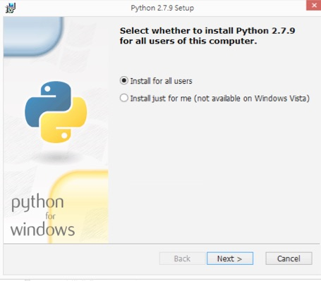
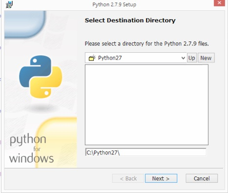
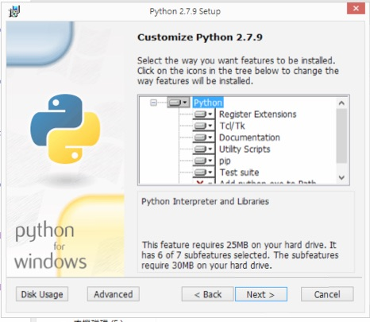
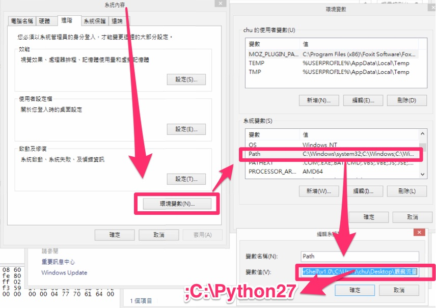
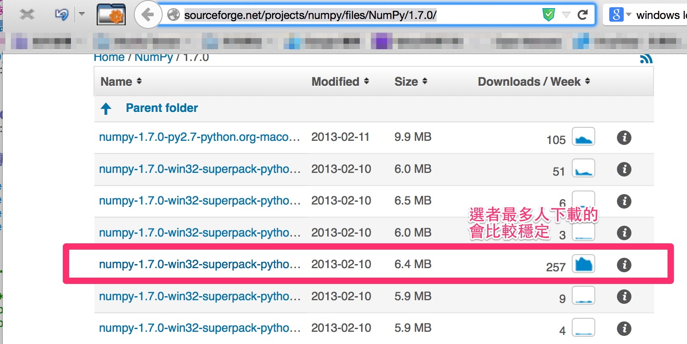

# Outline
##### Pcap檔案 => 轉換為文字檔 => 萃取domain => 算亂度來分出正常和異常domain name

### 前置準備
- 準備好Pcap檔案
- 電腦中安裝python2.7.9

python下載檔案路徑：https://www.python.org/

#### 安裝步驟

#### 環境配置，就是將安裝python的資料夾加入到path中，截圖如下：

#### python 安裝好後需要另外安裝numpy套件
下載路徑：http://sourceforge.net/projects/numpy/files/NumPy/1.7.0/

### Pcap檔案 => 轉換為文字檔
簡易方法：直接用`WIRESHARK`開啟，匯出為`csv`

### 轉換為文字檔 => 萃取domain

- ###### python程式名稱：refile.py
- ###### 執行程式方法：python` `refile.py` `logs.csv
- ###### 注意：此程式只有`針對`於`WIRESHARK`用csv匯出的檔案格式
- ###### 執行完成會有兩個檔案匯出，`twoCategory.txt`和`domainName.txt`

`refile.py`程式如下：

	# -*- coding: UTF-8 -*-
	import re
	import sys

	def appendWrite(filename,data):
		f = open(filename,"a")
		f.write(data)
		f.close
	#sys.argv[1]
		
	if __name__ == "__main__":
		twoCategory = "twoCategory.txt"
		domainName = "domainName.txt"
		f = open(sys.argv[1])
		d = []
		for line in f:
			if "A " and "DNS" in line:
				try:
					data =line.split(",")[0] +","+ line.split(",")[6].split(" ")[5] 
					print data
					data = data[0:-1]
					appendWrite(twoCategory,data+"\n")
					d.append(line.split(",")[6].split(" ")[5])
				except:
					print line
		dd =set(d)
		for line in dd:
			line = line[0:-1]
			appendWrite(domainName,line+"\n")
		f.close

### 萃取domain => 算亂度來分出正常和異常domain name
##### 執行方法：python` `dgascore.py` `domainName.txt 
##### 結果：
	jiankang.wangchao.net.cn. score: 0.000000 perp: 3.05471736861
	clients1.google.com. score: 0.000000 perp: 1.44268838855
	muying.wangchao.net.cn. score: 0.000000 perp: 1.41631415482
	fbstatic-a.akamaihd.net. score: 35.426153 perp: 1.94432644347
	zhubao.wangchao.net.cn. score: 0.000000 perp: 22.9313117664
	zhidao.wangchao.net.cn. score: 0.000000 perp: 22.9313117664
	junshi.wangchao.net.cn. score: 0.000000 perp: 3.38111007693
	accounts.youtube.com. score: 0.000000 perp: 1.14582487754
	accounts.google.com. score: 0.000000 perp: 1.15406357502
	meirong.wangchao.net.cn. score: 0.000000 perp: 1.39504250204
	tansuo.wangchao.net.cn. score: 17.962885 perp: 1.19006470323
	tw.bid.yahoo.com. score: 84.005009 perp: 1.270309482
	sd.symcd.com. score: 38.945323 perp: 1.88950308729
	y.analytics.yahoo.com. score: 40.279493 perp: 4.29963461215
	tw.yimg.com. score: 162.576642 perp: 1.41625399787

##### 解說：
- dgascore.py：是主程式
- domainName.txt：上一個步驟匯出的檔案名稱
- score：分數超過80就可能是異常的網域名稱

